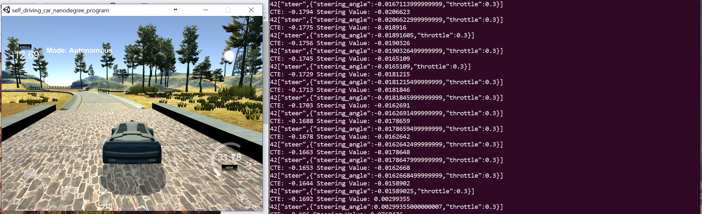
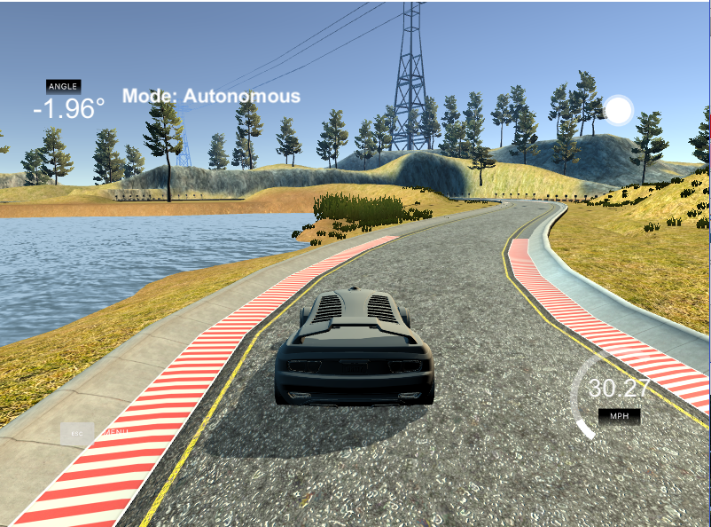

# CarND-Controls-PID
Self-Driving Car Engineer Nanodegree Program

## Rubric Reflections 

* Student describes the effect of the P, I, D component of the PID algorithm in their implementation. Is it what you expected?
* Student discusses how they chose the final hyperparameters (P, I, D coefficients). This could be have been done through manual tuning, twiddle, SGD, or something else, or a combination!

In this project, we implemented the PID Control for Self Driving Cars. The aim of this project was to use the Cross Track Error (CTE) provided by Udacity's simulator and adjust the PID controller to drive the care SAFELY through the terrain at a speeds of 30 MPH +-.

PID = Proportional Integral Derivative controller. It is a control loop feedback mechanism and in our case, operates on minimizing the Cross Track error for a self driving car. This is done by applying a correction adjustment based on proportional, integral, and derivative terms, which lend the controller its name. 

* "Proportional" or "P" for short, is the component that has the direct effect on the car's behavior. It causes the car to steer proportionally to the CTE, that is the car's center distance from the lane center. If the car is widely far to the left, it will adjust for the steering angle correction to go right. If its the opposite, the steering angle update will make it go left and try and keep the car as close to the center as possible. 

Ideally, this would be the only required parameter. Howevver, only using P leads to a lot of oscillations, swerving the car left and right - without leading to a stable drive. Large values of P will definitely cause the car to keep swerving.

* For this reason, we have an additional component "Differential (D)" which is the rate of change of the CTE. Because of this, as the CTE reduces, the steering won’t keep oscillating and hence, the car smoothly convergees to the target trajectory and drives itself in a stable manner. Large values of D can sometimes help in converging the car trajectory at sharp turns, while small values of D are not so useful towards the entire goal. 

* Lastly, there is the "Integral (I)" component which considers all past values of the CTE and sums them over to the current timestep. This helps in effectively reducing the systematic bias caused due to either steering drift caused during wheel tunings or residual error after applying the P - D controls. From the observations in the video, having a value of I = 0 caused the car to take very sharp turns at curves, while the turn curvatures reduced with I ~= 0.5. A comparitively large value of I (> 0.015) caused the car to start swverving again, and I believe that it kind-off negates the adjustment made by "D", and hence the effective output is just the value of "P". 

The below figure shows the effect of using "P", "P-D" and "P-I-D" based controllers. Reference: Udacity lessons on PID.


The final parameters were chosen manually, since implementing twiddle caused confusion for me, especially while deciding how many timesteps to evaluate and where to start from. I started off with the values in mind from the course lessons [0.2, 0.004, 3.0] and ended up at [0.15, 0.0005, 3.1]. Firstly, the D & I values were set to 0 to observe the car's functioning. Clearly, it was an oscillating mess. I later assigned an value to D and tuned P - D in sync to have the car drive itself smoothly. At this point, the car was working out ok, except at some curves and certain spots (below two figures). The value for I was then assigned and tuned on its own to have the car be effectively driven. One of the spots still has an issue - however, I believe (to the best of my knowlegde), the CTE becomes comparitively high there for some reason and hence, the car swerves. 



This figure shows a particular spot on the track where the car just takes a swerve without any reason - it is observed that the CTE randomly jumps to a higher value, hence causing the sharp turn. 


This figure shows the effect of "I" on the overall controller. Without "I", the curve turn here would have been a very sharp and oscillating one, however, with the use of "I", it transitions significantly smoothly. Then again, PID controllers alone are a bit overrated since they manage to take turns to minimize the CTE, but forget to include the physics of a car's functioning - for e.g. the sharp turns at curves would have probably caused the car to drift in real life, however, here it smoothly stays on the road. 

---

## Dependencies

* cmake >= 3.5
 * All OSes: [click here for installation instructions](https://cmake.org/install/)
* make >= 4.1(mac, linux), 3.81(Windows)
  * Linux: make is installed by default on most Linux distros
  * Mac: [install Xcode command line tools to get make](https://developer.apple.com/xcode/features/)
  * Windows: [Click here for installation instructions](http://gnuwin32.sourceforge.net/packages/make.htm)
* gcc/g++ >= 5.4
  * Linux: gcc / g++ is installed by default on most Linux distros
  * Mac: same deal as make - [install Xcode command line tools]((https://developer.apple.com/xcode/features/)
  * Windows: recommend using [MinGW](http://www.mingw.org/)
* [uWebSockets](https://github.com/uWebSockets/uWebSockets)
  * Run either `./install-mac.sh` or `./install-ubuntu.sh`.
  * If you install from source, checkout to commit `e94b6e1`, i.e.
    ```
    git clone https://github.com/uWebSockets/uWebSockets 
    cd uWebSockets
    git checkout e94b6e1
    ```
    Some function signatures have changed in v0.14.x. See [this PR](https://github.com/udacity/CarND-MPC-Project/pull/3) for more details.
* Simulator. You can download these from the [project intro page](https://github.com/udacity/self-driving-car-sim/releases) in the classroom.

There's an experimental patch for windows in this [PR](https://github.com/udacity/CarND-PID-Control-Project/pull/3)

## Basic Build Instructions

1. Clone this repo.
2. Make a build directory: `mkdir build && cd build`
3. Compile: `cmake .. && make`
4. Run it: `./pid`. 

Tips for setting up your environment can be found [here](https://classroom.udacity.com/nanodegrees/nd013/parts/40f38239-66b6-46ec-ae68-03afd8a601c8/modules/0949fca6-b379-42af-a919-ee50aa304e6a/lessons/f758c44c-5e40-4e01-93b5-1a82aa4e044f/concepts/23d376c7-0195-4276-bdf0-e02f1f3c665d)

## Editor Settings

We've purposefully kept editor configuration files out of this repo in order to
keep it as simple and environment agnostic as possible. However, we recommend
using the following settings:

* indent using spaces
* set tab width to 2 spaces (keeps the matrices in source code aligned)

## Code Style

Please (do your best to) stick to [Google's C++ style guide](https://google.github.io/styleguide/cppguide.html).

## Project Instructions and Rubric

Note: regardless of the changes you make, your project must be buildable using
cmake and make!

More information is only accessible by people who are already enrolled in Term 2
of CarND. If you are enrolled, see [the project page](https://classroom.udacity.com/nanodegrees/nd013/parts/40f38239-66b6-46ec-ae68-03afd8a601c8/modules/f1820894-8322-4bb3-81aa-b26b3c6dcbaf/lessons/e8235395-22dd-4b87-88e0-d108c5e5bbf4/concepts/6a4d8d42-6a04-4aa6-b284-1697c0fd6562)
for instructions and the project rubric.

## Hints!

* You don't have to follow this directory structure, but if you do, your work
  will span all of the .cpp files here. Keep an eye out for TODOs.

## Call for IDE Profiles Pull Requests

Help your fellow students!

We decided to create Makefiles with cmake to keep this project as platform
agnostic as possible. Similarly, we omitted IDE profiles in order to we ensure
that students don't feel pressured to use one IDE or another.

However! I'd love to help people get up and running with their IDEs of choice.
If you've created a profile for an IDE that you think other students would
appreciate, we'd love to have you add the requisite profile files and
instructions to ide_profiles/. For example if you wanted to add a VS Code
profile, you'd add:

* /ide_profiles/vscode/.vscode
* /ide_profiles/vscode/README.md

The README should explain what the profile does, how to take advantage of it,
and how to install it.

Frankly, I've never been involved in a project with multiple IDE profiles
before. I believe the best way to handle this would be to keep them out of the
repo root to avoid clutter. My expectation is that most profiles will include
instructions to copy files to a new location to get picked up by the IDE, but
that's just a guess.

One last note here: regardless of the IDE used, every submitted project must
still be compilable with cmake and make./

## How to write a README
A well written README file can enhance your project and portfolio.  Develop your abilities to create professional README files by completing [this free course](https://www.udacity.com/course/writing-readmes--ud777).

